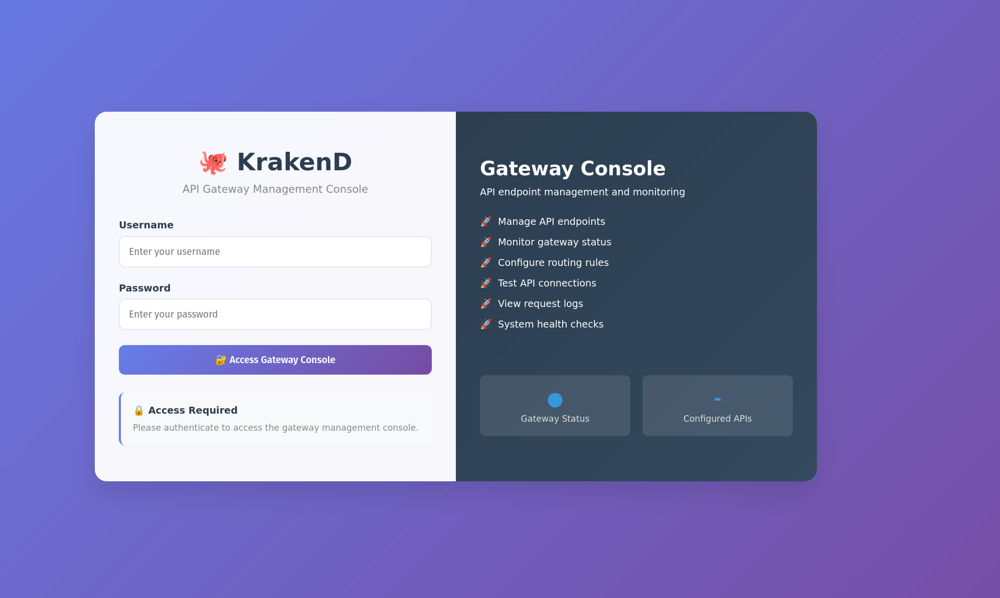
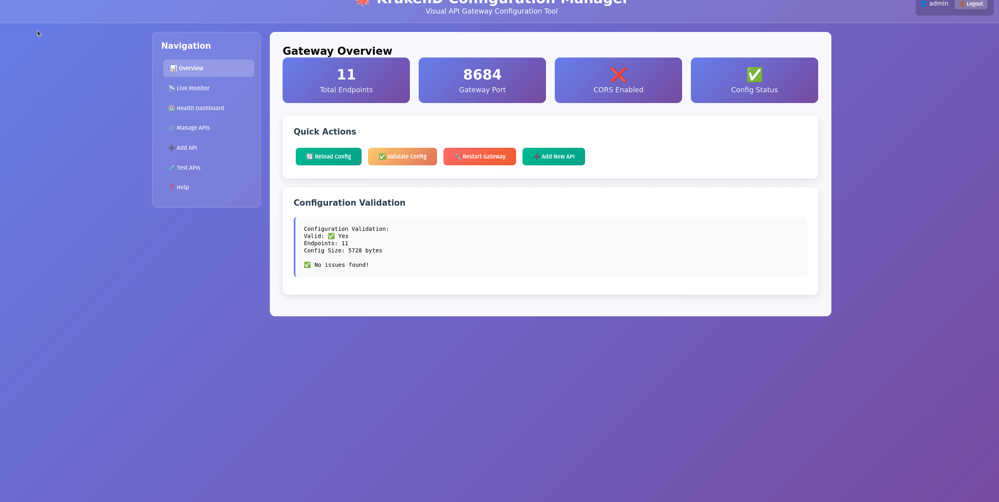

# KrakenD API Gateway

<div align="center">

[](https://sohaib1khan.github.io/krakend-gateway/)

**High-Performance Gateway |  Web Management |  Real-time Monitoring |  One-Command Setup**

*Production ready • Configuration management • Always evolving*

---
</div>

**High-Performance API Gateway with Web Management Interface**

A containerized KrakenD setup with web-based configuration management for API routing, load balancing, and endpoint management.

---

## Overview

**KrakenD Gateway** - Fast API Gateway that acts as a single entry point for your backend services, providing routing, aggregation, and transformation capabilities.

**Components included:**
- 🌐 **KrakenD Gateway** - Core API routing engine
- 🔧 **Management API** - REST API for configuration management  
- 📱 **Web Interface** - Browser-based configuration tool
- 🔒 **Authentication System** - Login and session management

---

## Quick Start

### Prerequisites
- [Docker](https://docs.docker.com/get-docker/)
- [Docker Compose](https://docs.docker.com/compose/install/)

### Clone the Repository
```bash
git clone https://github.com/sohaib1khan/krakend-gateway
cd krakend-gateway
```

### Start the Gateway
```bash
docker compose build && docker compose up -d
```

###  Access the Interfaces

- **🌐 Web Management**: http://localhost:5001
- **⚙️ API Gateway**: http://localhost:8684  
- **📚 Documentation**: http://localhost:5001/doc/

### Default Credentials

The web interface requires authentication. Use these default credentials:

| Username | Password | Role |
|----------|----------|------|
| **admin** | krakend123 | Administrator |
| **user** | password123 | Standard User |
| **demo** | demo123 | Demo User |

> **Note**: Update credentials in `management/app.py` before production use.

---

## Interface Preview

### Login Interface


### Management Dashboard


---

## Gateway Components

###  KrakenD Gateway

| Component | Port | Purpose |
|-----------|------|---------|
| **Gateway Engine** | 8684 | Routes API requests to backend services |
| **Management API** | 5001 | Configuration and control endpoints |
| **Web Interface** | 5001 | Browser-based configuration management |

### Directory Structure

| Directory | Purpose |
|-----------|---------|
| `config/` | KrakenD configuration files |
| `management/` | Python management API |
| `web-ui/` | Web interface files |
| `logs/` | Gateway and application logs |

### Network Configuration

Services communicate on `krakend-network` bridge network:

| Port | Service | Description |
|------|---------|-------------|
| **8684** | KrakenD Gateway | API request routing |
| **5001** | Management Interface | Configuration and web UI |

---

## Getting Started

### Basic Gateway Configuration

1. **Access Web Interface**
   ```bash
   # Open in browser
   http://localhost:5001
   ```

2. **Add Your First API Endpoint**
   - Navigate to "Add API" section
   - Configure gateway path: `/api/users`
   - Set backend URL: `http://user-service:3000`
   - Save and test the endpoint

3. **Test Gateway Routing**
   ```bash
   curl http://localhost:8684/api/users
   ```

### Validate Configuration

```bash
# Check configuration validity
curl http://localhost:5001/validate

# View current configuration
curl http://localhost:5001/config
```

---

## Gateway Management

### Configuration Management

```bash
# Get current configuration
curl http://localhost:5001/config

# Add new endpoint
curl -X POST http://localhost:5001/endpoints \
  -H "Content-Type: application/json" \
  -d '{
    "endpoint": "/api/products", 
    "method": "GET",
    "backend_host": "http://product-service:3000",
    "backend_path": "/products"
  }'

# Restart gateway with new config
curl -X POST http://localhost:5001/restart
```

### Stop the Gateway

```bash
docker-compose down
```

---

## API Gateway Features

### 🌐 Request Routing
- **Path-based routing** - Route requests based on URL paths
- **Method filtering** - Handle different HTTP methods
- **Backend mapping** - Map gateway endpoints to backend services

### ⚡ Performance  
- **High throughput** - Handle thousands of requests per second
- **Low latency** - Minimal overhead in request processing
- **Concurrent processing** - Parallel request handling

### 🔒 Security
- **Authentication** - Session-based login system
- **CORS support** - Cross-origin request handling
- **Rate limiting** - Request throttling capabilities

> **🔐 Credential Management**: Default users are stored in `management/app.py`. 
> For production deployment, consider using environment variables or a secure database.

---

## API Endpoint Management

### Adding Endpoints

Use the web interface or management API:

```json
{
  "endpoint": "/api/orders",
  "method": "GET", 
  "backend": [{
    "host": ["http://order-service:3000"],
    "url_pattern": "/orders"
  }]
}
```

### Testing Endpoints

```bash
# Test through gateway
curl http://localhost:8684/api/orders

# Test with parameters  
curl http://localhost:8684/api/orders?limit=10

# Test POST requests
curl -X POST http://localhost:8684/api/orders \
  -H "Content-Type: application/json" \
  -d '{"product": "laptop", "quantity": 1}'
```

---

## Troubleshooting

### Gateway Not Starting
```bash
# Check containers
docker-compose ps

# View gateway logs
docker-compose logs krakend

# View management logs  
docker-compose logs management
```

### Configuration Issues
```bash
# Validate configuration
curl http://localhost:5001/validate

# Restart gateway
curl -X POST http://localhost:5001/restart
```

### Backend Connection Problems
```bash
# Test backend directly
curl http://your-backend-service:port/endpoint

# Check gateway routing
curl -v http://localhost:8684/api/your-endpoint
```

---

## Common Solutions

**Gateway returns 404:**
- Check endpoint configuration in web UI
- Verify backend service is running
- Confirm URL paths match configuration

**Backend unreachable:**
- Check backend service health
- Verify network connectivity
- Review host/port configuration

**Configuration won't save:**
- Check JSON syntax in configuration
- Restart management service
- Review logs for validation errors

**Cannot login to web interface:**
- Verify credentials in `management/app.py`
- Check management service is running: `docker-compose logs management`
- Ensure port 5001 is accessible

---

## Documentation

**Interactive Documentation**: [doc/index.html](doc/index.html)

**Web Interface**: http://localhost:5001

**Gateway Health**: http://localhost:8684/health

---

## Configuration Files

- `docker-compose.yml` - Container orchestration
- `config/krakend.json` - Gateway routing configuration  
- `management/app.py` - Management API backend
- `web-ui/index.html` - Web interface
- `web-ui/login.html` - Authentication page
